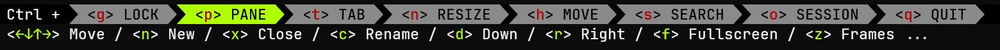

# Zellij - terminal workspaces

[Zellij](https://zellij.dev/) is a terminal multiplexer and I will use it instead of "gnu screen". It can be an alternative also to tmux or terminator.  
[Zellij](https://github.com/zellij-org/zellij) does not need a GUI (graphical use interface), because it works inside the text terminal. Great !  
Most of Linux servers don't even have a GUI, but can be used only with a text terminal over SSH.  
Zellij uses [NerdFonts](https://www.nerdfonts.com/) to make it look pretty.  

## Installation

I like to put my "personal" executables in ~/bin. So I can see what specific binaries I use over time. And I can easily make a backup.  
If ~/bin does not exist, create the folder and add it to $PATH. Add it inside ~/.bashrc to have it there after restart.  

```bash
mkdir ~/bin
# check if it is already included in $PATH?
echo $PATH
# if missing, add it to $PATH, but it will work only for this session, not after restart
export PATH="$HOME/bin:$PATH"
# check if it is ok
echo $PATH
```

Append this line into ~/.bashrc, so it will be there after bash restarts:  

```bash
nano ~/.bashrc
# appended this line if it does not already exist
export PATH="$HOME/bin:$PATH"
```

Download the latest release from GitHub, unpack it and make it executable.  

```bash
curl -L https://github.com/zellij-org/zellij/releases/download/v0.37.2/zellij-x86_64-unknown-linux-musl.tar.gz --output /tmp/zellij-x86_64-unknown-linux-musl.tar.gz
tar -xzv -C ~/bin -f /tmp/zellij-x86_64-unknown-linux-musl.tar.gz zellij
rm /tmp/zellij-x86_64-unknown-linux-musl.tar.gz
chmod +x ~/bin/zellij
```

## Nerd fonts

Original text in the text terminal is boring. It should be nice to have some common icons inside the text terminal.  
Welcome NerdFonts!  
I use Linux inside WSL on Win10. I choose the Windows Terminal as my terminal emulator. It means I can change the font of the Terminal in Settings. It is a font from Windows, by default it is Consolas. I choose to download from <https://www.nerdfonts.com/font-downloads> the JetBrainsMono font <https://github.com/ryanoasis/nerd-fonts/releases/download/v3.0.2/JetBrainsMono.zip>. Inside the zip there are a bunch of fonts with different thickness. I choose to install the `JetBrainsMonoNerdFont-Medium.ttf`. Unpack it somewhere then right click - Install font. It is now a Windows font.  
In Windows Terminal - Settings I go to Profiles - Debian - Appearances and change the Font face to `JetBrainsMono Nerd Font` then save the changed Settings.

## Zellij nomenclature

Zellij can have different "Sessions". A session can be easily attached or detached. When detached, a session still runs in the background. Great!  
A session can have multiple "Tabs". A tab can have one or more "Panes" in different positions.  
Zellij uses different "modes" that are activated by shortcuts like `Ctrl-g` (LOCK) or `Ctrl-t` (TAB) or `Ctrl-p` (PANE). The status-bar is visible by default and makes it easy to learn these shortcuts. Inside a mode there are then new shortcuts for running commands.  




## Run a new named session with layout

```bash
zellij --layout ~/.config/zellij/layouts/layout_web_server.kdl --session web_server
```

Layout specific for my web-server in the file `~/.config/zellij/layouts/layout_web_server.kdl`:

```kdl
// layout_web_server.kdl for my Google VM
// 5 tabs for different webapps and utils

layout {
    default_tab_template {
        pane size=1 borderless=true {
            plugin location="zellij:tab-bar"
        }
        children
        pane size=2 borderless=true {
            plugin location="zellij:status-bar"
        }
    }
    tab name="mem6_8086"{    
        pane{
            cwd "/var/www/webapps/mem6_game"        
            command "sudo"
            args "./mem6_server" "127.0.0.1" "8086"
        }
    }
    tab name="cargo_crev_web_8051" {
        pane{
            cwd "/var/www/webapps/cargo_crev_web"        
            command "./cargo_crev_web"
        }
    }
    tab name="cargo_crev_web_git"{    
        pane{
            cwd "$HOME"        
            command "foreground_scheduler"
            args "25" "cargo-crev" "crev repo fetch trusted"
        }
    }
    tab name="cargo_crev_web_admin" {
        pane{
            cwd "$HOME"    
            command "bash"            
            args "-ci" "cargo_crev_web_admin list_new_repos ; history -s cargo_crev_web_admin list_new_repos ; exec bash ;"
        }
    }
    tab name="podman_hit_counter" {
        pane{
            cwd "/var/www/transfer_folder/webpage_hit_counter"
            command "bash"
            args "-ci" "sh webpage_hit_counter_pod_create.sh ; podman logs webpage_hit_counter_cnt ; history -s podman logs webpage_hit_counter_cnt ; exec bash ;"
        }
    }
}
```

## Command pane or bash pane

When Zellij layouts opens a pane with a "command", then only this command will execute, not the interactive bash. This is ok for most purposes.  
That command can be closed with `Ctrl-c` then we can use `ENTER` to re-run it. But only this one command that is configured for that pane.  
If I need an interactive bash, than I will use a sequence of bash commands finishing with `exec bash`. The commands are separated by semicolon as standard in bash.  

## Detach and attach

Inside Zellij use `Ctrl-o` and then `d` to DETACH. All the tabs and panes will continue running in the background. Great !  
To list open sessions and then attach by session name use:  

```bash
zellij ls
zellij attach web_server
```

## Problem with `Ctrl-q`

Most of the time I don't want to quit a Zellij session. I want to detach the session. But pressing `Ctrl-q` is too easy and then BOOM, I loose my active session completely. I made a change to the configuration to not use directly `Ctrl-q` to quit Zellij.  
First create the default config file with a zellij command. More details here : [default-configuration](https://zellij.dev/documentation/overview.html?highlight=default#default-configuration). Then edit the config in your preferred editor.  

```bash
mkdir ~/.config/zellij
zellij setup --dump-config > ~/.config/zellij/config.kdl
nano ~/.config/zellij/config.kdl
```

In the node `keybinds - shared_except "locked"` remove the line

```kdl
bind "Ctrl q" { Quit; }
```

In the node `keybinds - normal` add

```kdl
unbind "Ctrl q"
```

In the node `keybinds - session` add

```kdl
bind "Ctrl q" { Quit; }
```

Now to quit Zellij I need 2 strokes: Ctrl-o then Ctrl-q. It is not so easy to mistype this.  
